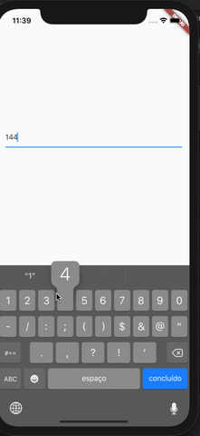

# masked_controller
 A controller to insert mask to textfield.
 


## Install

Follow this [GUIDE](https://pub.dev/packages/masked_controller#-installing-tab-)

## Usage

Import the library

```dart
import 'import 'package:masked_controller/masked_controller.dart';';
```
and the mask:
```dart
import 'package:masked_controller/mask.dart';
```

Create the Controller
```dart
final MaskedController _controller = MaskedController(mask: Mask(mask: 'NNN.NNN.NNN-NN'));
```
### Get unmasked value

To get the unsmaked value from controller, use the `unmaskedText` property:

```dart
final String val = controller.unmaskedText;
```

Inspired by:
  https://github.com/benhurott/flutter-masked-text
